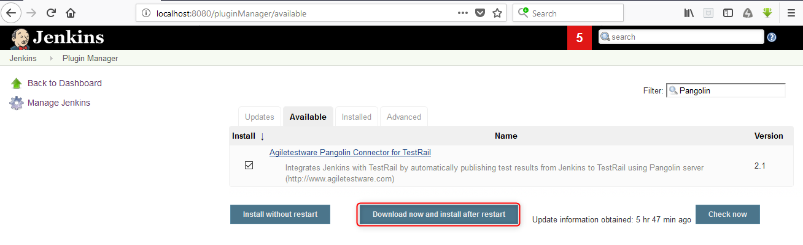

Agiletestware Pangolin Connector for TestRail
=============================================

**Pangolin is now Railflow!**

We are pleased to announce that Pangolin has been redesigned from the ground up and is now called [Railflow]("https://railflow.io/")  
  
Reason why we did this:

1.  Simplify the overall installation. (Railflow requires no server!)
2.  Support for all CICD systems like Jenkins, TeamCity, Github, Gitlab, CircleCI etc.
3.	New and improved pricing and licensing options.
4.	Tons of new features and capabilities.

The Railflow Jenkins Plugin can be downloaded from [our official page](https://railflow.io/resources/downloads).

Please visit [Railflow](https://railflow.io/) for the details.
       
Railflow Documentation is available [here](https://docs.railflow.io/docs/intro)

------------------------------------------------------------

# Introduction

Agiletestware Pangolin TestRail Connector plugin integrates Jenkins with [TestRail](https://www.gurock.com/testrail) by automatically publishing test results from Jenkins to [TestRail](https://www.gurock.com/testrail) using [Pangolin server](https://www.agiletestware.com/pangolin)

The plugin allows users to
integrate [TestRail](http://www.gurock.com/testrail/) into their CI workflow without writing a single line of code.

## Prerequisites

[Pangolin Server](https://agiletestware.com/docs/pangolin-docs/en/latest/setup/server-installation/) must be installed and accessible from Jenkins host

## Jenkins plugin Installation
Installation of Jenkins plugin can be easily done from Jenkins Plugin Manager:

Please restart Jenkins Server after the installation of plugin.

## [Pangolin Global Configuration](https://www.agiletestware.com/docs/pangolin-docs/en/latest/ci-integration/jenkins/#-global-settings-configuration)

## [Uploading test framework reports into TestRail](https://www.agiletestware.com/docs/pangolin-docs/en/latest/ci-integration/jenkins/#-uploading-test-results-into-testrail)
	